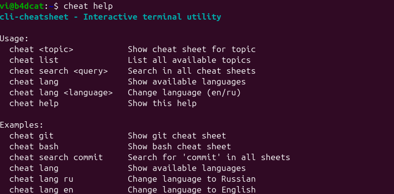
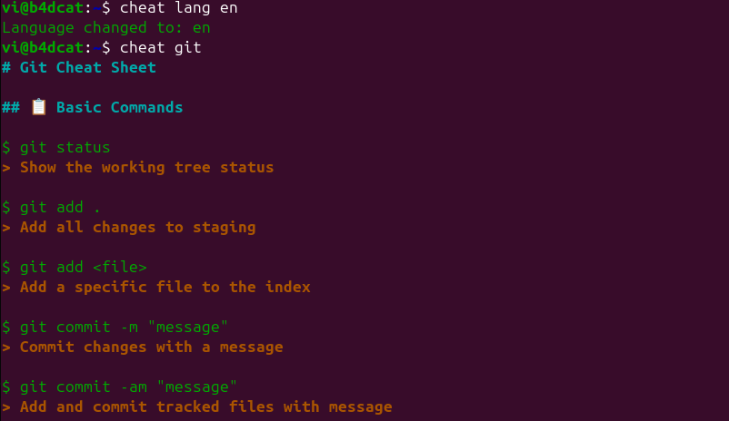
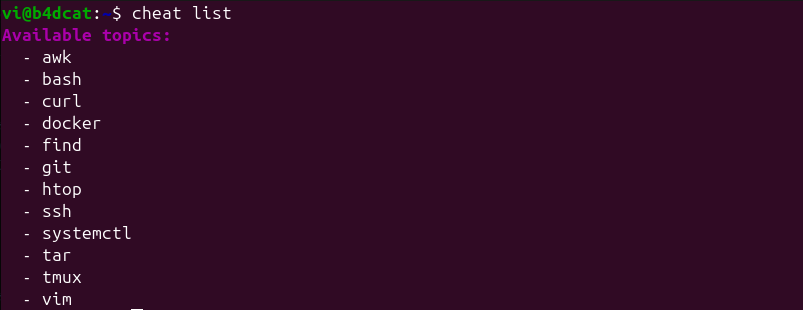
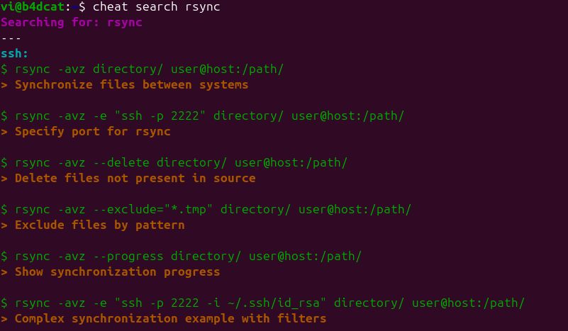

# cli-cheatsheet

[](https://opensource.org/licenses/MIT)
[](https://www.gnu.org/software/bash/)
[](https://en.wikipedia.org/wiki/Unix-like)

An interactive terminal utility for quick command reference.

<details>
<summary>🌍 Choose your language / Выберите язык</summary>

| Language | Documentation |
|----------|---------------|
| 🇺🇸 English | [README.md](README.md) (current) |
| 🇷🇺 Русский | [docs/ru/README.md](docs/ru/README.md) |

</details>

## 🚀 Idea

Call `cheat <topic>` to display a concise and useful cheat sheet for commands (bash, git, docker, vim, systemctl, etc.).

## ✨ Features
- `cheat <topic>` — shows a text cheat sheet by key
- **Comprehensive topic support**: `cheat git`, `cheat bash`, `cheat docker`, `cheat systemctl`, `cheat tmux`, `cheat htop`, `cheat curl`, `cheat ssh`, `cheat find`
- **Colorful output** (headers, commands, descriptions)
- **Autocompletion or list all topics**: `cheat list`
- **Advanced search functionality**: `cheat search <query>` with grouped results by topic
- **Multi-language support** (en/ru) with JSON-based translations
- **Theme support** (light/dark)
- **Language switching**: `cheat lang <language>`
- **Template-based system** with placeholder substitution
- **Optimized performance** with efficient translation lookup

## 📊 Cheat Sheets Status

| Utility | 🇺🇸 English | 🇷🇺 Русский | 🇩🇪 Deutsch | 🇫🇷 Français | 🇪🇸 Español |
|---------|-------------|-------------|-------------|--------------|-------------|
| bash | ✅ | ✅ | ❌ | ❌ | ❌ |
| git | ✅ | ✅ | ❌ | ❌ | ❌ |
| docker | ✅ | ✅ | ❌ | ❌ | ❌ |
| vim | ✅ | ✅ | ❌ | ❌ | ❌ |
| systemctl | ✅ | ✅ | ❌ | ❌ | ❌ |
| tmux | ✅ | ✅ | ❌ | ❌ | ❌ |
| htop | ✅ | ✅ | ❌ | ❌ | ❌ |
| curl | ✅ | ✅ | ❌ | ❌ | ❌ |
| ssh | ✅ | ✅ | ❌ | ❌ | ❌ |
| find | ✅ | ✅ | ❌ | ❌ | ❌ |
| tar | ✅ | ✅ | ❌ | ❌ | ❌ |
| awk | ✅ | ✅ | ❌ | ❌ | ❌ |
| cron | ✅ | ✅ | ❌ | ❌ | ❌ |
| sed | ✅ | ✅ | ❌ | ❌ | ❌ |
| netstat | ✅ | ✅ | ❌ | ❌ | ❌ |
| lsof | ✅ | ✅ | ❌ | ❌ | ❌ |
| nmap | ✅ | ✅ | ❌ | ❌ | ❌ |
| ufw | ✅ | ✅ | ❌ | ❌ | ❌ |
| make | 🔄 | 🔄 | ❌ | ❌ | ❌ |
| iptables | 🔄 | 🔄 | ❌ | ❌ | ❌ |
| package-managers | ✅ | ✅ | ❌ | ❌ | ❌ |

**Legend:**
- ✅ Available - Complete cheat sheet with translations
- ❌ Not available - Cheat sheet or translations missing
- 🔄 In progress - Currently being developed

## 📁 Project Structure
```
cli-cheatsheet/
├── cheat.sh              # Main script
├── config.json           # Configuration
├── localizations/        # Translation files by language
│   ├── en/              # English translations
│   │   ├── bash.json    # Bash translations
│   │   ├── git.json     # Git translations
│   │   ├── docker.json  # Docker translations
│   │   ├── vim.json     # Vim translations
│   │   ├── systemctl.json # Systemctl translations
│   │   ├── tmux.json    # Tmux translations
│   │   ├── htop.json    # Htop translations
│   │   ├── curl.json    # Curl translations
│   │   ├── ssh.json     # SSH translations
│   │   ├── find.json    # Find translations
│   │   ├── tar.json     # Tar translations
│   │   └── awk.json     # AWK translations
│   └── ru/              # Russian translations
│       ├── bash.json    # Bash translations
│       ├── git.json     # Git translations
│       ├── docker.json  # Docker translations
│       ├── vim.json     # Vim translations
│       ├── systemctl.json # Systemctl translations
│       ├── tmux.json    # Tmux translations
│       ├── htop.json    # Htop translations
│       ├── curl.json    # Curl translations
│       ├── ssh.json     # SSH translations
│       ├── find.json    # Find translations
│       ├── tar.json     # Tar translations
│       └── awk.json     # AWK translations
├── templates/            # Cheat sheet templates
│   ├── bash.txt         # Bash template
│   ├── git.txt          # Git template
│   ├── docker.txt       # Docker template
│   ├── vim.txt          # Vim template
│   ├── systemctl.txt    # Systemctl template
│   ├── tmux.txt         # Tmux template
│   ├── htop.txt         # Htop template
│   ├── curl.txt         # Curl template
│   ├── ssh.txt          # SSH template
│   ├── find.txt         # Find template
│   ├── tar.txt          # Tar template
│   └── awk.txt          # AWK template
└── docs/                # Documentation
    └── ru/              # Russian documentation
        └── README.md    # Russian README
```

## 🛠️ Installation

### Quick Install (Recommended)
```bash
git clone https://github.com/mrvi0/cli-cheatsheet.git
cd cli-cheatsheet
sudo ln -s "$(pwd)/cheat.sh" /usr/local/bin/cheat
```

**After installation, you can use `cheat` command from anywhere in your system!**

### Manual Install
```bash
git clone https://github.com/mrvi0/cli-cheatsheet.git
cd cli-cheatsheet
chmod +x cheat.sh
./cheat.sh <topic>
```

## 📸 Screenshots

<div align="center">
  
  <p><em>Help command output and usage instructions</em></p>
</div>

<div align="center">
  
  <p><em>Git cheat sheet with language switching example</em></p>
</div>

<div align="center">
  
  <p><em>Available topics and utilities list</em></p>
</div>

<div align="center">
  
  <p><em>Advanced search across all cheat sheets</em></p>
</div>

## 📖 Usage Examples

### Show cheat sheet
```bash
$ cheat git
# Git Cheat Sheet

$ git status
> Show the working tree status

$ git add .
> Add all changes to staging

$ git commit -m "message"
> Commit changes with a message

$ git log
> Show commit logs
```

### List all topics
```bash
$ cheat list
Available topics:
  - awk
  - bash
  - cron
  - curl
  - docker
  - find
  - git
  - htop
  - sed
  - ssh
  - systemctl
  - tar
  - tmux
  - vim
```

### Search in cheat sheets
```bash
$ cheat search commit
Searching for: commit
---
git:
$ git commit -m "message"
> Commit changes with a message

$ cheat search find
Searching for: find
---
find:
$ find . -name "filename"
> Find files by exact name

$ find . -type f -name "*.txt"
> Find text files
```

### Change language
```bash
$ cheat lang ru
Language changed to: ru

$ cheat git
# Git Шпаргалка

$ git status
> Показать статус рабочей директории
```

### Update utility
```bash
$ cheat update
Updating cli-cheatsheet...
Current branch: main
Fetching latest changes...
Found 3 new commit(s)
Pulling latest changes...
Successfully updated cli-cheatsheet!
```

### Get help
```bash
$ cheat help
cli-cheatsheet - Interactive terminal utility

Usage:
  cheat <topic>           Show cheat sheet for topic
  cheat list              List all available topics
  cheat search <query>    Search in all cheat sheets
  cheat lang <language>   Change language (en/ru)
  cheat update            Update to latest version
  cheat help              Show this help

Examples:
  cheat git               Show git cheat sheet
  cheat bash              Show bash cheat sheet
  cheat search commit     Search for 'commit' in all sheets
  cheat lang ru           Change language to Russian
  cheat lang en           Change language to English
  cheat update            Update to latest version
```

## 🌍 Language Support

### Change Language via CLI
```bash
cheat lang ru    # Switch to Russian
cheat lang en    # Switch to English
```

### Change Language via Config
Edit `config.json`:
```json
{
  "lang": "ru",
  "theme": "dark"
}
```

### Add New Language
1. Create directory: `localizations/your_lang/`
2. Create translation files for each utility: `localizations/your_lang/utility.json`
3. Add translations with keys matching templates
4. Use `cheat lang your_lang` to switch

## 🎨 Color Scheme
- **Headers** (`#`) - Cyan bold
- **Commands** (`$`) - Green
- **Descriptions** (`>`) - Yellow
- **Errors** - Red
- **Search results** - Magenta

## 📝 Adding New Topics

Create a new file `templates/your_topic.txt`:
```
# {your_topic_title}

$ command example
> {command_description}

$ another command
> {another_description}
```

Then add translations to `localizations/en.json` and `localizations/ru.json`:
```json
{
  "your_topic_title": "Your Topic Cheat Sheet",
  "command_description": "Description of what this command does",
  "another_description": "Another description"
}
```

### Template Format
- Use `{key_name}` placeholders for translations
- Commands start with `$`
- Descriptions start with `>`
- Headers start with `#`
- Add empty lines between commands for better readability

## 📚 Documentation

- [English Documentation](README.md) (current)
- [Russian Documentation](docs/ru/README.md)
- [Changelog](CHANGELOG.md) - Complete version history

## 🤝 Contributing

We welcome contributions! Please see [CONTRIBUTING.md](CONTRIBUTING.md) for detailed guidelines on how to contribute to this project.

## 📄 License

This project is licensed under the MIT License - see the [LICENSE](LICENSE) file for details.

## 🙏 Acknowledgments

- Inspired by the need for quick command reference
- Built with pure bash for maximum compatibility
- Color support for better readability 