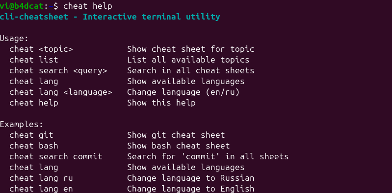
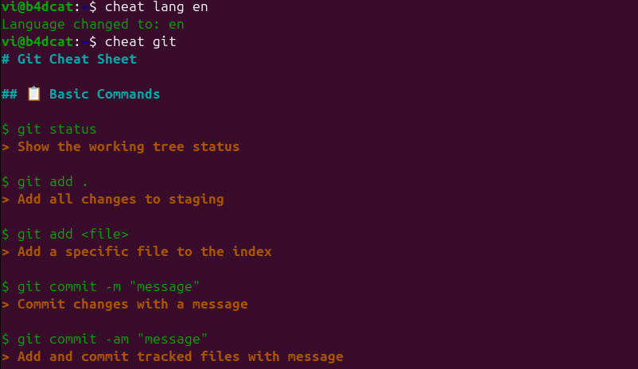
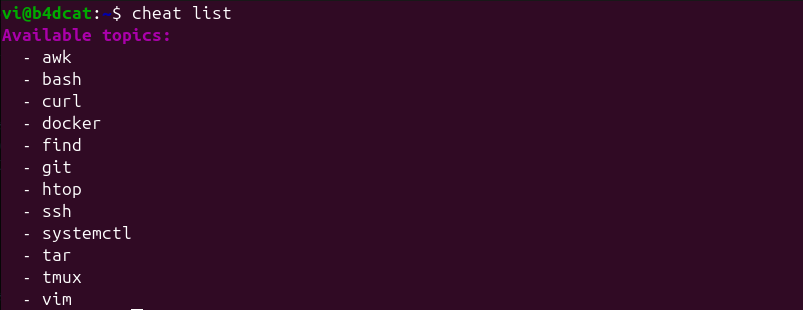
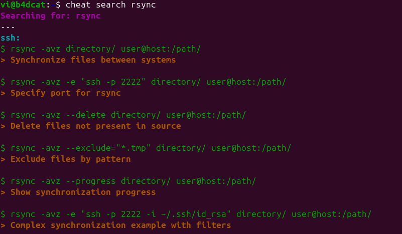

# cli-cheatsheet

[](https://opensource.org/licenses/MIT)
[](https://www.gnu.org/software/bash/)
[](https://en.wikipedia.org/wiki/Unix-like)

Интерактивная утилита для терминала — быстрая шпаргалка по командам.

## 🚀 Идея

Вызовите `cheat <тема>`, чтобы получить краткую и полезную шпаргалку по командам (bash, git, docker, vim, systemctl и др.).

## ✨ Функционал
- `cheat <тема>` — выводит текстовую шпаргалку по ключу
- **Расширенная поддержка тем**: `cheat git`, `cheat bash`, `cheat docker`, `cheat systemctl`, `cheat tmux`, `cheat htop`, `cheat curl`, `cheat ssh`, `cheat find`
- **Цветной вывод** (заголовки, команды, описания)
- **Автодополнение или вывод всех тем**: `cheat list`
- **Продвинутая функция поиска**: `cheat search <запрос>` с группировкой результатов по темам
- **Поддержка языков** (en/ru) с JSON-переводами
- **Поддержка тем** (светлая/тёмная)
- **Смена языка**: `cheat lang <язык>`
- **Система шаблонов** с подстановкой плейсхолдеров
- **Оптимизированная производительность** с эффективным поиском переводов

## 📊 Статус шпаргалок

### 🔧 Системные утилиты
| Утилита | 🇺🇸 English | 🇷🇺 Русский | 🇩🇪 Deutsch | 🇫🇷 Français | 🇪🇸 Español |
|---------|-------------|-------------|-------------|--------------|-------------|
| bash | ✅ | ✅ | ❌ | ❌ | ❌ |
| systemctl | ✅ | ✅ | ❌ | ❌ | ❌ |
| cron | ✅ | ✅ | ❌ | ❌ | ❌ |
| htop | ✅ | ✅ | ❌ | ❌ | ❌ |
| tmux | ✅ | ✅ | ❌ | ❌ | ❌ |

### 🌐 Сетевые утилиты
| Утилита | 🇺🇸 English | 🇷🇺 Русский | 🇩🇪 Deutsch | 🇫🇷 Français | 🇪🇸 Español |
|---------|-------------|-------------|-------------|--------------|-------------|
| curl | ✅ | ✅ | ❌ | ❌ | ❌ |
| ssh | ✅ | ✅ | ❌ | ❌ | ❌ |
| netstat | ✅ | ✅ | ❌ | ❌ | ❌ |
| nmap | ✅ | ✅ | ❌ | ❌ | ❌ |
| lsof | ✅ | ✅ | ❌ | ❌ | ❌ |

### 🛡️ Безопасность и файрволы
| Утилита | 🇺🇸 English | 🇷🇺 Русский | 🇩🇪 Deutsch | 🇫🇷 Français | 🇪🇸 Español |
|---------|-------------|-------------|-------------|--------------|-------------|
| ufw | ✅ | ✅ | ❌ | ❌ | ❌ |
| iptables | ✅ | ✅ | ❌ | ❌ | ❌ |

### 📝 Обработка текста
| Утилита | 🇺🇸 English | 🇷🇺 Русский | 🇩🇪 Deutsch | 🇫🇷 Français | 🇪🇸 Español |
|---------|-------------|-------------|-------------|--------------|-------------|
| vim | ✅ | ✅ | ❌ | ❌ | ❌ |
| sed | ✅ | ✅ | ❌ | ❌ | ❌ |
| awk | ✅ | ✅ | ❌ | ❌ | ❌ |

### 🔍 Файловая система и поиск
| Утилита | 🇺🇸 English | 🇷🇺 Русский | 🇩🇪 Deutsch | 🇫🇷 Français | 🇪🇸 Español |
|---------|-------------|-------------|-------------|--------------|-------------|
| find | ✅ | ✅ | ❌ | ❌ | ❌ |

### 📦 Архивирование и сжатие
| Утилита | 🇺🇸 English | 🇷🇺 Русский | 🇩🇪 Deutsch | 🇫🇷 Français | 🇪🇸 Español |
|---------|-------------|-------------|-------------|--------------|-------------|
| tar | ✅ | ✅ | ❌ | ❌ | ❌ |

### 🐳 Контейнеризация
| Утилита | 🇺🇸 English | 🇷🇺 Русский | 🇩🇪 Deutsch | 🇫🇷 Français | 🇪🇸 Español |
|---------|-------------|-------------|-------------|--------------|-------------|
| docker | ✅ | ✅ | ❌ | ❌ | ❌ |

### 🔧 Инструменты разработки
| Утилита | 🇺🇸 English | 🇷🇺 Русский | 🇩🇪 Deutsch | 🇫🇷 Français | 🇪🇸 Español |
|---------|-------------|-------------|-------------|--------------|-------------|
| git | ✅ | ✅ | ❌ | ❌ | ❌ |
| make | 🔄 | 🔄 | ❌ | ❌ | ❌ |

### 📦 Управление пакетами
| Утилита | 🇺🇸 English | 🇷🇺 Русский | 🇩🇪 Deutsch | 🇫🇷 Français | 🇪🇸 Español |
|---------|-------------|-------------|-------------|--------------|-------------|
| package-managers | ✅ | ✅ | ❌ | ❌ | ❌ |

**Условные обозначения:**
- ✅ Доступно - Полная шпаргалка с переводами
- ❌ Недоступно - Шпаргалка или переводы отсутствуют
- 🔄 В разработке - В настоящее время разрабатывается

## 🚀 Планируемые утилиты

### 🔧 Системные утилиты
- `ps` - Статус и управление процессами
- `kill` / `pkill` - Завершение процессов
- `nice` / `renice` - Управление приоритетами процессов
- `top` - Мониторинг процессов
- `iotop` - Мониторинг I/O
- `useradd` / `userdel` - Управление пользователями
- `groupadd` / `groupdel` - Управление группами
- `sudo` / `su` - Повышение привилегий
- `mount` / `umount` - Монтирование файловых систем

### 🌐 Сетевые утилиты
- `ping` / `ping6` - Тестирование сетевой связности
- `traceroute` / `mtr` - Трассировка сетевого пути
- `dig` / `nslookup` - DNS запросы
- `whois` - Информация о доменах
- `wget` - Загрузка файлов
- `rsync` - Синхронизация файлов
- `nc` (netcat) - Сетевая утилита
- `socat` - Многофункциональный сетевой релей
- `iftop` - Мониторинг сетевого трафика
- `nethogs` - Использование сети по процессам

### 🛡️ Безопасность и файрволы
- `fail2ban` - Защита от брутфорса
- `openssl` - Криптографические утилиты
- `gpg` - Шифрование и подписи
- `ssh-keygen` - Генерация SSH ключей

### 📝 Обработка текста
- `grep` / `egrep` / `fgrep` - Поиск в тексте
- `cut` - Извлечение полей
- `paste` - Объединение строк
- `join` - Объединение файлов
- `sort` / `uniq` - Сортировка и уникальность
- `wc` - Подсчет слов/строк/символов
- `tr` - Замена символов
- `rev` - Переворот строк
- `nano` - Простой текстовый редактор
- `jq` - Обработка JSON
- `yq` - Обработка YAML

### 🔍 Файловая система и поиск
- `locate` / `updatedb` - Быстрый поиск файлов
- `fd` - Современная альтернатива find
- `ripgrep` (rg) - Быстрый поиск в тексте
- `ls` - Список файлов (расширенные опции)
- `cp` / `mv` / `rm` - Операции с файлами
- `chmod` / `chown` - Управление правами доступа
- `ln` - Создание ссылок
- `du` / `df` - Использование диска
- `file` - Определение типа файла

### 📦 Архивирование и сжатие
- `zip` / `unzip` - ZIP архивы
- `7z` - 7-Zip архивы
- `gzip` / `gunzip` - Сжатие gzip
- `bzip2` / `bunzip2` - Сжатие bzip2
- `xz` / `unxz` - Сжатие xz
- `zstd` - Современное сжатие

### 🐳 Контейнеризация
- `docker-compose` - Оркестрация контейнеров
- `podman` - Альтернатива Docker
- `buildah` - Создание образов
- `skopeo` - Операции с образами
- `virsh` - Управление KVM
- `virt-manager` - GUI для виртуализации

### 🔧 Инструменты разработки
- `at` - Разовое планирование задач
- `anacron` - Cron для ноутбуков
- `service` - Управление сервисами
- `systemd` - Системный демон

### 📊 Анализ данных
- `csvkit` - Обработка CSV
- `sqlite3` - Операции с базой данных
- `bc` - Калькулятор
- `dc` - Калькулятор обратной польской записи
- `units` - Конвертер единиц
- `hexdump` / `xxd` - Просмотр в hex
- `strings` - Извлечение строк
- `objdump` - Анализ бинарных файлов

## 📁 Структура проекта
```
cli-cheatsheet/
├── cheat.sh              # Основной скрипт
├── config.json           # Конфигурация
├── localizations/        # Файлы переводов по языкам
│   ├── en/              # Английские переводы
│   │   ├── bash.json    # Переводы для bash
│   │   ├── git.json     # Переводы для git
│   │   ├── docker.json  # Переводы для docker
│   │   ├── vim.json     # Переводы для vim
│   │   ├── systemctl.json # Переводы для systemctl
│   │   ├── tmux.json    # Переводы для tmux
│   │   ├── htop.json    # Переводы для htop
│   │   ├── curl.json    # Переводы для curl
│   │   ├── ssh.json     # Переводы для ssh
│   │   ├── find.json    # Переводы для find
│   │   ├── tar.json     # Переводы для tar
│   │   └── awk.json     # Переводы для awk
│   └── ru/              # Русские переводы
│       ├── bash.json    # Переводы для bash
│       ├── git.json     # Переводы для git
│       ├── docker.json  # Переводы для docker
│       ├── vim.json     # Переводы для vim
│       ├── systemctl.json # Переводы для systemctl
│       ├── tmux.json    # Переводы для tmux
│       ├── htop.json    # Переводы для htop
│       ├── curl.json    # Переводы для curl
│       ├── ssh.json     # Переводы для ssh
│       ├── find.json    # Переводы для find
│       ├── tar.json     # Переводы для tar
│       └── awk.json     # Переводы для awk
├── templates/            # Шаблоны шпаргалок
│   ├── bash.txt         # Шаблон bash
│   ├── git.txt          # Шаблон git
│   ├── docker.txt       # Шаблон docker
│   ├── vim.txt          # Шаблон vim
│   ├── systemctl.txt    # Шаблон systemctl
│   ├── tmux.txt         # Шаблон tmux
│   ├── htop.txt         # Шаблон htop
│   ├── curl.txt         # Шаблон curl
│   ├── ssh.txt          # Шаблон ssh
│   ├── find.txt         # Шаблон find
│   ├── tar.txt          # Шаблон tar
│   └── awk.txt          # Шаблон awk
└── docs/                # Документация
    └── ru/              # Русская документация
        └── README.md    # Русский README
```

## 🛠️ Установка

### Быстрая установка (Рекомендуется)
```bash
git clone https://github.com/mrvi0/cli-cheatsheet.git
cd cli-cheatsheet
sudo ln -s "$(pwd)/cheat.sh" /usr/local/bin/cheat
```

**После установки вы можете использовать команду `cheat` из любой директории в системе!**

### Ручная установка
```bash
git clone https://github.com/mrvi0/cli-cheatsheet.git
cd cli-cheatsheet
chmod +x cheat.sh
./cheat.sh <тема>
```

## 📸 Скриншоты

<div align="center">
  
  <p><em>Вывод команды help и инструкции по использованию</em></p>
</div>

<div align="center">
  
  <p><em>Шпаргалка Git с примером смены языка</em></p>
</div>

<div align="center">
  
  <p><em>Список доступных тем и утилит</em></p>
</div>

<div align="center">
  
  <p><em>Продвинутый поиск по всем шпаргалкам</em></p>
</div>

## 📖 Примеры использования

### Показать шпаргалку
```bash
$ cheat git
# Git Шпаргалка

$ git status
> Показать статус рабочей директории

$ git add .
> Добавить все изменения в индекс

$ git commit -m "message"
> Зафиксировать изменения с сообщением

$ git log
> Показать журнал коммитов
```

### Список всех тем
```bash
$ cheat list
Available topics:
  - awk
  - bash
  - cron
  - curl
  - docker
  - find
  - git
  - htop
  - sed
  - ssh
  - systemctl
  - tar
  - tmux
  - vim
```

### Поиск в шпаргалках
```bash
$ cheat search commit
Searching for: commit
---
git:
$ git commit -m "message"
> Зафиксировать изменения с сообщением

$ cheat search find
Searching for: find
---
find:
$ find . -name "filename"
> Найти файлы по точному имени

$ find . -type f -name "*.txt"
> Найти текстовые файлы
```

### Смена языка
```bash
$ cheat lang en
Language changed to: en

$ cheat git
# Git Cheat Sheet

$ git status
> Show the working tree status
```

### Обновление утилиты
```bash
$ cheat update
Updating cli-cheatsheet...
Current branch: main
Fetching latest changes...
Found 3 new commit(s)
Pulling latest changes...
Successfully updated cli-cheatsheet!
```

### Получить справку
```bash
$ cheat help
cli-cheatsheet - Interactive terminal utility

Usage:
  cheat <topic>           Show cheat sheet for topic
  cheat list              List all available topics
  cheat search <query>    Search in all cheat sheets
  cheat lang <language>   Change language (en/ru)
  cheat update            Update to latest version
  cheat help              Show this help

Examples:
  cheat git               Show git cheat sheet
  cheat bash              Show bash cheat sheet
  cheat search commit     Search for 'commit' in all sheets
  cheat lang ru           Change language to Russian
  cheat lang en           Change language to English
  cheat update            Update to latest version
```

## 🌍 Поддержка языков

### Смена языка через CLI
```bash
cheat lang ru    # Переключиться на русский
cheat lang en    # Переключиться на английский
```

### Смена языка через конфигурацию
Отредактируйте `config.json`:
```json
{
  "lang": "ru",
  "theme": "dark"
}
```

### Добавить новый язык
1. Создайте файл: `localizations/ваш_язык.json`
2. Добавьте переводы с ключами, соответствующими шаблонам
3. Используйте `cheat lang ваш_язык` для переключения

## 🎨 Цветовая схема
- **Заголовки** (`#`) - Голубые жирные
- **Команды** (`$`) - Зелёные
- **Описания** (`>`) - Жёлтые
- **Ошибки** - Красные
- **Результаты поиска** - Пурпурные

## 📝 Добавление новых тем

Создайте новый файл `templates/ваша_тема.txt`:
```
# {ваша_тема_title}

$ пример команды
> {описание_команды}

$ другая команда
> {другое_описание}
```

Затем добавьте переводы в `localizations/ru.json` и `localizations/en.json`:
```json
{
  "ваша_тема_title": "Шпаргалка по вашей теме",
  "описание_команды": "Описание того, что делает эта команда",
  "другое_описание": "Другое описание"
}
```

### Формат шаблона
- Используйте плейсхолдеры `{имя_ключа}` для переводов
- Команды начинаются с `$`
- Описания начинаются с `>`
- Заголовки начинаются с `#`
- Добавляйте пустые строки между командами для лучшей читаемости

## 📚 Документация

- [English Documentation](../README.md)
- [Russian Documentation](README.md) (current)
- [Changelog](../CHANGELOG.md) - Полная история версий

## 🤝 Участие в разработке

Мы приветствуем вклад в развитие проекта! Пожалуйста, ознакомьтесь с [CONTRIBUTING.md](CONTRIBUTING.md) для подробных руководств по участию в разработке этого проекта.

## 📄 Лицензия

Этот проект лицензирован под MIT License - см. файл [LICENSE](../LICENSE) для подробностей.

## 🙏 Благодарности

- Вдохновлён необходимостью быстрой справки по командам
- Построен на чистом bash для максимальной совместимости
- Поддержка цветов для лучшей читаемости 

$ cheat sed           # Шпаргалка по sed 